# Data Dictionary และ Entity Relationship Diagram (ERD)

> เอกสารนี้อธิบายโครงสร้างฐานข้อมูลของระบบ RMUTT DubaiBoy  
> สร้างเมื่อ: 17 ธันวาคม 2567

---

## สารบัญ

1. [Entity Relationship Diagram (ERD)](#entity-relationship-diagram-erd)
2. [Data Dictionary](#data-dictionary)
   - [User Management](#1-user-management)
   - [Material Management](#2-material-management)
   - [Inventory Management](#3-inventory-management)
   - [Product Management](#4-product-management)
   - [Production Planning](#5-production-planning)
   - [Purchase Order](#6-purchase-order)
   - [Audit & Notification](#7-audit--notification)

---

## Entity Relationship Diagram (ERD)

```mermaid
erDiagram
    %% ========== USER MANAGEMENT ==========
    users {
        int id PK
        string email UK
        string username UK
        string fullname
        text password
        string role
        boolean is_active
        text refresh_token
        timestamp created_at
        timestamp updated_at
        timestamp deleted_at
    }

    %% ========== MASTER DATA ==========
    material_group {
        int group_id PK
        varchar group_name
        varchar abbreviation
        boolean is_active
        timestamp create_at
        timestamp deleted_at
    }

    material_units {
        int unit_id PK
        varchar unit_name
        timestamp create_at
        boolean is_active
        timestamp deleted_at
    }

    material_container_type {
        int type_id PK
        varchar type_name
        timestamp create_at
        boolean is_active
        timestamp deleted_at
    }

    supplier {
        int supplier_id PK
        varchar supplier_name
        varchar phone
        varchar email
        varchar address
        boolean is_active
        timestamp update_date
        timestamp deleted_at
    }

    warehouse_master {
        int warehouse_master_id PK
        varchar warehouse_name
        varchar warehouse_code
        varchar warehouse_phone
        varchar warehouse_address
        varchar warehouse_email
        boolean is_active
        timestamp warehouse_deleted_at
        timestamp warehouse_created_at
        timestamp warehouse_updated_at
    }

    product_type {
        int product_type_id PK
        varchar type_name UK
        boolean is_active
        timestamp create_at
        timestamp updated_at
        timestamp deleted_at
    }

    %% ========== MATERIAL ==========
    material_master {
        int material_id PK
        int material_group_id FK
        varchar material_name
        int order_leadtime
        int container_type_id FK
        int quantity_per_container
        int unit_id FK
        int container_min_stock
        int container_max_stock
        int lifetime
        varchar lifetime_unit
        boolean is_active
        timestamp update_date
        float cost_per_unit
        timestamp expiration_date
        int supplier_id FK
        timestamp deleted_at
    }

    %% ========== INVENTORY ==========
    material_inventory {
        int inventory_id PK
        int material_id FK
        int warehouse_id FK
        int quantity
        int reserved_quantity
        varchar order_number
        timestamp mfg_date
        timestamp exp_date
        timestamp created_at
        timestamp updated_at
        timestamp deleted_at
    }

    inventory_transaction {
        int inventory_transaction_id PK
        int material_inventory_id FK
        int warehouse_id FK
        varchar transaction_type
        timestamp transaction_date
        int quantity_change
        varchar reference_number
        varchar reason_remarks
        timestamp created_at
        timestamp updated_at
        timestamp deleted_at
    }

    %% ========== PRODUCT ==========
    product {
        int product_id PK
        varchar product_name UK
        int product_type_id FK
        int product_plan_id FK
        boolean is_active
        timestamp created_at
        timestamp updated_at
        timestamp deleted_at
    }

    BOM {
        int id PK
        int product_id FK
        int material_id FK
        int unit_id FK
        decimal usage_per_piece
        varchar version
        boolean active
        decimal scrap_factor
        timestamp created_at
        timestamp updated_at
        timestamp deleted_at
    }

    %% ========== PRODUCTION PLANNING ==========
    product_plan {
        int plan_id PK
        int product_id FK
        int input_quantity
        varchar plan_name
        text plan_description
        date start_date
        date end_date
        varchar plan_status
        varchar plan_priority
        int actual_produced_quantity
        decimal estimated_cost
        decimal actual_cost
        timestamp started_at
        timestamp completed_at
        timestamp cancelled_at
        text cancel_reason
        timestamp created_at
        timestamp updated_at
        timestamp deleted_at
    }

    plan_material_allocation {
        int id PK
        int plan_id FK
        int material_id FK
        int warehouse_id FK
        int inventory_id FK
        decimal allocated_quantity
        decimal used_quantity
        decimal returned_quantity
        decimal unit_cost
        timestamp created_at
        timestamp updated_at
    }

    %% ========== PURCHASE ORDER ==========
    purchase_order {
        int po_id PK
        varchar po_number UK
        int supplier_id FK
        timestamp order_date
        timestamp expected_delivery_date
        timestamp actual_delivery_date
        enum status
        decimal total_amount
        text notes
        timestamp created_at
        timestamp updated_at
    }

    purchase_order_item {
        int po_item_id PK
        int po_id FK
        int material_id FK
        decimal quantity
        decimal unit_price
        decimal subtotal
    }

    %% ========== AUDIT & NOTIFICATION ==========
    audit_logs {
        int id PK
        int user_id
        varchar username
        enum action
        enum entity_type
        varchar entity_id
        jsonb old_values
        jsonb new_values
        timestamp created_at
    }

    push_subscription {
        int id PK
        varchar endpoint
        int user_id FK
        json p256dh
        json auth
        timestamp created_at
        timestamp updated_at
        timestamp deleted_at
    }

    push_log {
        int id PK
        int subscription_id FK
        int user_id
        varchar title
        text message
        json payload_json
        varchar status
        text error_message
        timestamp sent_at
    }

    %% ========== RELATIONSHIPS ==========
    
    %% User relationships
    users ||--o{ push_subscription : "has"
    
    %% Material Master relationships
    material_group ||--o{ material_master : "categorizes"
    material_container_type ||--o{ material_master : "defines container"
    material_units ||--o{ material_master : "measures"
    supplier ||--o{ material_master : "supplies"
    
    %% Inventory relationships
    material_master ||--o{ material_inventory : "stored in"
    warehouse_master ||--o{ material_inventory : "holds"
    material_inventory ||--o{ inventory_transaction : "records"
    warehouse_master ||--o{ inventory_transaction : "tracks"
    
    %% Product relationships
    product_type ||--o{ product : "classifies"
    product ||--o{ BOM : "composed of"
    material_master ||--o{ BOM : "used in"
    material_units ||--o{ BOM : "measured by"
    
    %% Production Plan relationships
    product ||--o{ product_plan : "planned for"
    product_plan ||--o{ plan_material_allocation : "allocates"
    material_master ||--o{ plan_material_allocation : "allocated"
    warehouse_master ||--o{ plan_material_allocation : "from warehouse"
    material_inventory ||--o{ plan_material_allocation : "from inventory"
    
    %% Purchase Order relationships
    supplier ||--o{ purchase_order : "receives orders"
    purchase_order ||--o{ purchase_order_item : "contains"
    material_master ||--o{ purchase_order_item : "ordered"
    
    %% Push Notification relationships
    push_subscription ||--o{ push_log : "logs"
```

---

## Data Dictionary

### 1. User Management

#### 1.1 users (ผู้ใช้งานระบบ)

| Column | Data Type | Constraint | Description |
|--------|-----------|------------|-------------|
| `id` | INT | PK, AUTO_INCREMENT | รหัสผู้ใช้ |
| `email` | VARCHAR | UNIQUE, NOT NULL | อีเมล |
| `username` | VARCHAR | UNIQUE, NOT NULL | ชื่อผู้ใช้ |
| `fullname` | VARCHAR | NOT NULL | ชื่อ-นามสกุล |
| `password` | TEXT | NOT NULL | รหัสผ่าน (Hashed with bcrypt) |
| `role` | VARCHAR | DEFAULT 'user' | บทบาท (admin, user) |
| `is_active` | BOOLEAN | DEFAULT true | สถานะการใช้งาน |
| `refresh_token` | TEXT | NULLABLE | Token สำหรับ refresh session |
| `created_at` | TIMESTAMP | AUTO | วันที่สร้าง |
| `updated_at` | TIMESTAMP | AUTO | วันที่แก้ไขล่าสุด |
| `deleted_at` | TIMESTAMP | NULLABLE | วันที่ลบ (Soft Delete) |

---

### 2. Material Management

#### 2.1 material_group (กลุ่มวัตถุดิบ)

| Column | Data Type | Constraint | Description |
|--------|-----------|------------|-------------|
| `group_id` | INT | PK, AUTO_INCREMENT | รหัสกลุ่มวัตถุดิบ |
| `group_name` | VARCHAR | NOT NULL | ชื่อกลุ่มวัตถุดิบ |
| `abbreviation` | VARCHAR | NOT NULL | ตัวย่อกลุ่ม |
| `is_active` | BOOLEAN | DEFAULT true | สถานะการใช้งาน |
| `create_at` | TIMESTAMP | AUTO | วันที่สร้าง |
| `deleted_at` | TIMESTAMP | NULLABLE | วันที่ลบ (Soft Delete) |

#### 2.2 material_units (หน่วยนับวัตถุดิบ)

| Column | Data Type | Constraint | Description |
|--------|-----------|------------|-------------|
| `unit_id` | INT | PK, AUTO_INCREMENT | รหัสหน่วยนับ |
| `unit_name` | VARCHAR | NOT NULL | ชื่อหน่วยนับ (เช่น กิโลกรัม, ชิ้น) |
| `create_at` | TIMESTAMP | AUTO | วันที่สร้าง |
| `is_active` | BOOLEAN | DEFAULT true | สถานะการใช้งาน |
| `deleted_at` | TIMESTAMP | NULLABLE | วันที่ลบ (Soft Delete) |

#### 2.3 material_container_type (ประเภทบรรจุภัณฑ์)

| Column | Data Type | Constraint | Description |
|--------|-----------|------------|-------------|
| `type_id` | INT | PK, AUTO_INCREMENT | รหัสประเภทบรรจุภัณฑ์ |
| `type_name` | VARCHAR | NOT NULL | ชื่อประเภท (เช่น ถุง, กล่อง) |
| `create_at` | TIMESTAMP | AUTO | วันที่สร้าง |
| `is_active` | BOOLEAN | DEFAULT true | สถานะการใช้งาน |
| `deleted_at` | TIMESTAMP | NULLABLE | วันที่ลบ (Soft Delete) |

#### 2.4 supplier (ผู้จัดจำหน่าย)

| Column | Data Type | Constraint | Description |
|--------|-----------|------------|-------------|
| `supplier_id` | INT | PK, AUTO_INCREMENT | รหัสผู้จัดจำหน่าย |
| `supplier_name` | VARCHAR | NULLABLE | ชื่อผู้จัดจำหน่าย |
| `phone` | VARCHAR | NULLABLE | เบอร์โทรศัพท์ |
| `email` | VARCHAR | NULLABLE | อีเมล |
| `address` | VARCHAR | NULLABLE | ที่อยู่ |
| `is_active` | BOOLEAN | DEFAULT true | สถานะการใช้งาน |
| `update_date` | TIMESTAMP | AUTO | วันที่แก้ไขล่าสุด |
| `deleted_at` | TIMESTAMP | NULLABLE | วันที่ลบ (Soft Delete) |

#### 2.5 material_master (ข้อมูลหลักวัตถุดิบ)

| Column | Data Type | Constraint | Description |
|--------|-----------|------------|-------------|
| `material_id` | INT | PK, AUTO_INCREMENT | รหัสวัตถุดิบ |
| `material_group_id` | INT | FK → material_group | รหัสกลุ่มวัตถุดิบ |
| `material_name` | VARCHAR | NOT NULL | ชื่อวัตถุดิบ |
| `order_leadtime` | INT | NULLABLE | ระยะเวลานำสั่งซื้อ (วัน) |
| `container_type_id` | INT | FK → material_container_type | รหัสประเภทบรรจุภัณฑ์ |
| `quantity_per_container` | INT | NULLABLE | จำนวนต่อบรรจุภัณฑ์ |
| `unit_id` | INT | FK → material_units | รหัสหน่วยนับ |
| `container_min_stock` | INT | NULLABLE | สต็อกขั้นต่ำ (บรรจุภัณฑ์) |
| `container_max_stock` | INT | NULLABLE | สต็อกสูงสุด (บรรจุภัณฑ์) |
| `lifetime` | INT | NULLABLE | อายุการใช้งาน |
| `lifetime_unit` | VARCHAR | NULLABLE | หน่วยอายุ (วัน, เดือน, ปี) |
| `is_active` | BOOLEAN | DEFAULT true | สถานะการใช้งาน |
| `update_date` | TIMESTAMP | AUTO | วันที่แก้ไขล่าสุด |
| `cost_per_unit` | FLOAT | NULLABLE | ราคาต่อหน่วย |
| `expiration_date` | TIMESTAMP | NULLABLE | วันหมดอายุ |
| `supplier_id` | INT | FK → supplier | รหัสผู้จัดจำหน่าย |
| `deleted_at` | TIMESTAMP | NULLABLE | วันที่ลบ (Soft Delete) |

---

### 3. Inventory Management

#### 3.1 warehouse_master (คลังสินค้า)

| Column | Data Type | Constraint | Description |
|--------|-----------|------------|-------------|
| `warehouse_master_id` | INT | PK, AUTO_INCREMENT | รหัสคลังสินค้า |
| `warehouse_name` | VARCHAR | NULLABLE | ชื่อคลังสินค้า |
| `warehouse_code` | VARCHAR | NULLABLE | รหัสคลัง |
| `warehouse_phone` | VARCHAR | NULLABLE | เบอร์โทรศัพท์ |
| `warehouse_address` | VARCHAR | NULLABLE | ที่อยู่ |
| `warehouse_email` | VARCHAR | NULLABLE | อีเมล |
| `is_active` | BOOLEAN | DEFAULT true | สถานะการใช้งาน |
| `warehouse_created_at` | TIMESTAMP | AUTO | วันที่สร้าง |
| `warehouse_updated_at` | TIMESTAMP | AUTO | วันที่แก้ไขล่าสุด |
| `warehouse_deleted_at` | TIMESTAMP | NULLABLE | วันที่ลบ (Soft Delete) |

#### 3.2 material_inventory (สต็อกวัตถุดิบ)

| Column | Data Type | Constraint | Description |
|--------|-----------|------------|-------------|
| `inventory_id` | INT | PK, AUTO_INCREMENT | รหัส Inventory |
| `material_id` | INT | FK → material_master | รหัสวัตถุดิบ |
| `warehouse_id` | INT | FK → warehouse_master | รหัสคลังสินค้า |
| `quantity` | INT | NOT NULL | จำนวนคงเหลือ |
| `reserved_quantity` | INT | DEFAULT 0 | จำนวนที่จอง |
| `order_number` | VARCHAR | NULLABLE | เลขที่ใบสั่งซื้อ |
| `mfg_date` | TIMESTAMP | NULLABLE | วันที่ผลิต |
| `exp_date` | TIMESTAMP | NULLABLE | วันหมดอายุ |
| `created_at` | TIMESTAMP | AUTO | วันที่สร้าง |
| `updated_at` | TIMESTAMP | AUTO | วันที่แก้ไขล่าสุด |
| `deleted_at` | TIMESTAMP | NULLABLE | วันที่ลบ (Soft Delete) |

#### 3.3 inventory_transaction (บันทึกการเคลื่อนไหวสต็อก)

| Column | Data Type | Constraint | Description |
|--------|-----------|------------|-------------|
| `inventory_transaction_id` | INT | PK, AUTO_INCREMENT | รหัส Transaction |
| `material_inventory_id` | INT | FK → material_inventory | รหัส Inventory |
| `warehouse_id` | INT | FK → warehouse_master | รหัสคลังสินค้า |
| `transaction_type` | VARCHAR | NOT NULL | ประเภท (IN, OUT, ADJUST) |
| `transaction_date` | TIMESTAMP | NOT NULL | วันที่ทำรายการ |
| `quantity_change` | INT | NOT NULL | จำนวนที่เปลี่ยนแปลง |
| `reference_number` | VARCHAR | NOT NULL | เลขที่อ้างอิง |
| `reason_remarks` | VARCHAR | NOT NULL | หมายเหตุ/เหตุผล |
| `created_at` | TIMESTAMP | AUTO | วันที่สร้าง |
| `updated_at` | TIMESTAMP | AUTO | วันที่แก้ไขล่าสุด |
| `deleted_at` | TIMESTAMP | NULLABLE | วันที่ลบ (Soft Delete) |

---

### 4. Product Management

#### 4.1 product_type (ประเภทสินค้า)

| Column | Data Type | Constraint | Description |
|--------|-----------|------------|-------------|
| `product_type_id` | INT | PK, AUTO_INCREMENT | รหัสประเภทสินค้า |
| `type_name` | VARCHAR | UNIQUE, NOT NULL | ชื่อประเภท |
| `is_active` | BOOLEAN | DEFAULT true | สถานะการใช้งาน |
| `create_at` | TIMESTAMP | AUTO | วันที่สร้าง |
| `updated_at` | TIMESTAMP | AUTO | วันที่แก้ไขล่าสุด |
| `deleted_at` | TIMESTAMP | NULLABLE | วันที่ลบ (Soft Delete) |

#### 4.2 product (สินค้า)

| Column | Data Type | Constraint | Description |
|--------|-----------|------------|-------------|
| `product_id` | INT | PK, AUTO_INCREMENT | รหัสสินค้า |
| `product_name` | VARCHAR | UNIQUE, NOT NULL | ชื่อสินค้า |
| `product_type_id` | INT | FK → product_type | รหัสประเภทสินค้า |
| `product_plan_id` | INT | FK → product_plan | รหัสแผนการผลิต |
| `is_active` | BOOLEAN | DEFAULT true | สถานะการใช้งาน |
| `created_at` | TIMESTAMP | AUTO | วันที่สร้าง |
| `updated_at` | TIMESTAMP | AUTO | วันที่แก้ไขล่าสุด |
| `deleted_at` | TIMESTAMP | NULLABLE | วันที่ลบ (Soft Delete) |

#### 4.3 BOM (Bill of Materials / สูตรการผลิต)

| Column | Data Type | Constraint | Description |
|--------|-----------|------------|-------------|
| `id` | INT | PK, AUTO_INCREMENT | รหัส BOM |
| `product_id` | INT | FK → product, UNIQUE with material_id | รหัสสินค้า |
| `material_id` | INT | FK → material_master, UNIQUE with product_id | รหัสวัตถุดิบ |
| `unit_id` | INT | FK → material_units | รหัสหน่วยนับ |
| `usage_per_piece` | DECIMAL | NOT NULL | ปริมาณใช้ต่อชิ้น |
| `version` | VARCHAR | NOT NULL | เวอร์ชันสูตร |
| `active` | BOOLEAN | NOT NULL | สถานะการใช้งาน |
| `scrap_factor` | DECIMAL | NOT NULL | อัตราของเสีย (%) |
| `created_at` | TIMESTAMP | AUTO | วันที่สร้าง |
| `updated_at` | TIMESTAMP | AUTO | วันที่แก้ไขล่าสุด |
| `deleted_at` | TIMESTAMP | NULLABLE | วันที่ลบ (Soft Delete) |

---

### 5. Production Planning

#### 5.1 product_plan (แผนการผลิต)

| Column | Data Type | Constraint | Description |
|--------|-----------|------------|-------------|
| `plan_id` | INT | PK, AUTO_INCREMENT | รหัสแผนการผลิต |
| `product_id` | INT | FK → product | รหัสสินค้า |
| `input_quantity` | INT | NULLABLE | จำนวนที่ต้องการผลิต |
| `plan_name` | VARCHAR | NULLABLE | ชื่อแผน |
| `plan_description` | TEXT | NULLABLE | รายละเอียดแผน |
| `start_date` | DATE | NULLABLE | วันเริ่มต้น |
| `end_date` | DATE | NULLABLE | วันสิ้นสุด |
| `plan_status` | VARCHAR | DEFAULT 'DRAFT' | สถานะ (DRAFT, CONFIRMED, IN_PROGRESS, COMPLETED, CANCELLED) |
| `plan_priority` | VARCHAR | DEFAULT 'LOW' | ความสำคัญ (LOW, MEDIUM, HIGH, CRITICAL) |
| `actual_produced_quantity` | INT | NULLABLE | จำนวนที่ผลิตได้จริง |
| `estimated_cost` | DECIMAL(15,2) | NULLABLE | ต้นทุนประมาณการ |
| `actual_cost` | DECIMAL(15,2) | NULLABLE | ต้นทุนจริง |
| `started_at` | TIMESTAMP | NULLABLE | วันเวลาเริ่มผลิตจริง |
| `completed_at` | TIMESTAMP | NULLABLE | วันเวลาผลิตเสร็จ |
| `cancelled_at` | TIMESTAMP | NULLABLE | วันเวลายกเลิก |
| `cancel_reason` | TEXT | NULLABLE | เหตุผลการยกเลิก |
| `created_at` | TIMESTAMP | AUTO | วันที่สร้าง |
| `updated_at` | TIMESTAMP | AUTO | วันที่แก้ไขล่าสุด |
| `deleted_at` | TIMESTAMP | NULLABLE | วันที่ลบ (Soft Delete) |

**Plan Status Values:**
| Status | Description |
|--------|-------------|
| `DRAFT` | ร่าง - กำลังวางแผน |
| `CONFIRMED` | ยืนยันแล้ว - พร้อมเริ่มผลิต |
| `IN_PROGRESS` | กำลังดำเนินการ - อยู่ระหว่างผลิต |
| `COMPLETED` | เสร็จสิ้น - ผลิตเสร็จแล้ว |
| `CANCELLED` | ยกเลิก - ยกเลิกการผลิต |

**Plan Priority Values:**
| Priority | Description |
|----------|-------------|
| `LOW` | ต่ำ |
| `MEDIUM` | ปานกลาง |
| `HIGH` | สูง |
| `CRITICAL` | เร่งด่วนมาก |

#### 5.2 plan_material_allocation (การจัดสรรวัตถุดิบให้แผน)

| Column | Data Type | Constraint | Description |
|--------|-----------|------------|-------------|
| `id` | INT | PK, AUTO_INCREMENT | รหัสการจัดสรร |
| `plan_id` | INT | FK → product_plan | รหัสแผนการผลิต |
| `material_id` | INT | FK → material_master | รหัสวัตถุดิบ |
| `warehouse_id` | INT | FK → warehouse_master | รหัสคลังสินค้าที่ดึง |
| `inventory_id` | INT | FK → material_inventory | รหัส Inventory ที่ดึง |
| `allocated_quantity` | DECIMAL(15,3) | NOT NULL | จำนวนที่จอง |
| `used_quantity` | DECIMAL(15,3) | DEFAULT 0 | จำนวนที่ใช้จริง |
| `returned_quantity` | DECIMAL(15,3) | DEFAULT 0 | จำนวนที่คืน stock |
| `unit_cost` | DECIMAL(15,2) | NOT NULL | ราคาต่อหน่วย ณ ขณะจอง |
| `created_at` | TIMESTAMP | AUTO | วันที่สร้าง |
| `updated_at` | TIMESTAMP | AUTO | วันที่แก้ไขล่าสุด |

---

### 6. Purchase Order

#### 6.1 purchase_order (ใบสั่งซื้อ)

| Column | Data Type | Constraint | Description |
|--------|-----------|------------|-------------|
| `po_id` | INT | PK, AUTO_INCREMENT | รหัสใบสั่งซื้อ |
| `po_number` | VARCHAR | UNIQUE, NOT NULL | เลขที่ใบสั่งซื้อ |
| `supplier_id` | INT | FK → supplier | รหัสผู้จัดจำหน่าย |
| `order_date` | TIMESTAMP | NOT NULL | วันที่สั่งซื้อ |
| `expected_delivery_date` | TIMESTAMP | NOT NULL | วันที่คาดว่าจะได้รับ |
| `actual_delivery_date` | TIMESTAMP | NULLABLE | วันที่ได้รับจริง |
| `status` | ENUM | DEFAULT 'PENDING' | สถานะ |
| `total_amount` | DECIMAL(10,2) | DEFAULT 0 | ยอดรวม |
| `notes` | TEXT | NULLABLE | หมายเหตุ |
| `created_at` | TIMESTAMP | AUTO | วันที่สร้าง |
| `updated_at` | TIMESTAMP | AUTO | วันที่แก้ไขล่าสุด |

**PurchaseOrder Status Values:**
| Status | Description |
|--------|-------------|
| `PENDING` | รอดำเนินการ |
| `CONFIRMED` | ยืนยันแล้ว |
| `SHIPPED` | จัดส่งแล้ว |
| `DELIVERED` | ได้รับแล้ว |
| `CANCELLED` | ยกเลิก |
| `DELAYED` | ล่าช้า |

#### 6.2 purchase_order_item (รายการในใบสั่งซื้อ)

| Column | Data Type | Constraint | Description |
|--------|-----------|------------|-------------|
| `po_item_id` | INT | PK, AUTO_INCREMENT | รหัสรายการ |
| `po_id` | INT | FK → purchase_order, ON DELETE CASCADE | รหัสใบสั่งซื้อ |
| `material_id` | INT | FK → material_master | รหัสวัตถุดิบ |
| `quantity` | DECIMAL(10,2) | NOT NULL | จำนวน |
| `unit_price` | DECIMAL(10,2) | NOT NULL | ราคาต่อหน่วย |
| `subtotal` | DECIMAL(10,2) | NOT NULL | ยอดรวมรายการ |

---

### 7. Audit & Notification

#### 7.1 audit_logs (บันทึกการเปลี่ยนแปลง)

| Column | Data Type | Constraint | Description |
|--------|-----------|------------|-------------|
| `id` | INT | PK, AUTO_INCREMENT | รหัส Log |
| `user_id` | INT | NULLABLE | รหัสผู้ใช้ที่ทำรายการ |
| `username` | VARCHAR | NULLABLE | ชื่อผู้ใช้ |
| `action` | ENUM | NOT NULL | ประเภทการกระทำ |
| `entity_type` | ENUM | NOT NULL | ประเภท Entity |
| `entity_id` | VARCHAR | NULLABLE | รหัส Entity ที่ถูกแก้ไข |
| `old_values` | JSONB | NULLABLE | ค่าเดิม |
| `new_values` | JSONB | NULLABLE | ค่าใหม่ |
| `created_at` | TIMESTAMP | AUTO | วันเวลาที่ทำรายการ |

**Audit Action Values:**
- `CREATE`, `UPDATE`, `DELETE`, `RESTORE`
- `LOGIN_SUCCESS`, `LOGIN_FAILED`, `LOGOUT`, `PASSWORD_CHANGE`
- `STATUS_CHANGE`, `CONFIRM`, `START`, `COMPLETE`, `CANCEL`

**Audit Entity Values:**
- `USER`, `MATERIAL_MASTER`, `SUPPLIER`, `WAREHOUSE_MASTER`
- `BOM`, `PRODUCT_PLAN`, `PLAN_LIST`
- `SECURITY`

#### 7.2 push_subscription (การติดตาม Push Notification)

| Column | Data Type | Constraint | Description |
|--------|-----------|------------|-------------|
| `id` | INT | PK, AUTO_INCREMENT | รหัส Subscription |
| `endpoint` | VARCHAR(255) | NOT NULL | Endpoint URL ของ Browser |
| `user_id` | INT | FK → users | รหัสผู้ใช้ |
| `p256dh` | JSON | NOT NULL | Public Key (p256dh) |
| `auth` | JSON | NOT NULL | Auth Key |
| `created_at` | TIMESTAMP | AUTO | วันที่สมัคร |
| `updated_at` | TIMESTAMP | AUTO | วันที่แก้ไขล่าสุด |
| `deleted_at` | TIMESTAMP | NULLABLE | วันที่ยกเลิก (Soft Delete) |

#### 7.3 push_log (บันทึกการส่ง Push Notification)

| Column | Data Type | Constraint | Description |
|--------|-----------|------------|-------------|
| `id` | INT | PK, AUTO_INCREMENT | รหัส Log |
| `subscription_id` | INT | FK → push_subscription | รหัส Subscription |
| `user_id` | INT | NULLABLE | รหัสผู้ใช้ |
| `title` | VARCHAR | NOT NULL | หัวข้อแจ้งเตือน |
| `message` | TEXT | NOT NULL | เนื้อหาแจ้งเตือน |
| `payload_json` | JSON | NULLABLE | ข้อมูลเพิ่มเติม |
| `status` | VARCHAR(20) | NOT NULL | สถานะ (SUCCESS, FAILED) |
| `error_message` | TEXT | NULLABLE | ข้อความ Error (ถ้ามี) |
| `sent_at` | TIMESTAMP | AUTO | วันเวลาที่ส่ง |

---

## สรุปความสัมพันธ์หลัก

| Parent Entity | Child Entity | Relationship | Description |
|--------------|--------------|--------------|-------------|
| `users` | `push_subscription` | 1:N | ผู้ใช้มีหลาย Subscription |
| `material_group` | `material_master` | 1:N | กลุ่มมีหลายวัตถุดิบ |
| `material_units` | `material_master` | 1:N | หน่วยใช้กับหลายวัตถุดิบ |
| `material_container_type` | `material_master` | 1:N | ประเภทบรรจุภัณฑ์ใช้กับหลายวัตถุดิบ |
| `supplier` | `material_master` | 1:N | ผู้จัดจำหน่ายมีหลายวัตถุดิบ |
| `material_master` | `material_inventory` | 1:N | วัตถุดิบเก็บในหลาย Inventory |
| `warehouse_master` | `material_inventory` | 1:N | คลังมีหลาย Inventory |
| `material_inventory` | `inventory_transaction` | 1:N | Inventory มีหลาย Transaction |
| `product_type` | `product` | 1:N | ประเภทมีหลายสินค้า |
| `product` | `BOM` | 1:N | สินค้ามีหลายส่วนประกอบ |
| `material_master` | `BOM` | 1:N | วัตถุดิบใช้ในหลายสินค้า |
| `product` | `product_plan` | 1:N | สินค้ามีหลายแผนการผลิต |
| `product_plan` | `plan_material_allocation` | 1:N | แผนมีหลายการจัดสรรวัตถุดิบ |
| `supplier` | `purchase_order` | 1:N | ผู้จัดจำหน่ายมีหลายใบสั่งซื้อ |
| `purchase_order` | `purchase_order_item` | 1:N | ใบสั่งซื้อมีหลายรายการ |
| `push_subscription` | `push_log` | 1:N | Subscription มีหลาย Log |

---

## หมายเหตุ

1. **Soft Delete**: ทุก Entity หลักรองรับ Soft Delete ผ่าน column `deleted_at`
2. **Timestamps**: ทุก Entity มี `created_at` และ `updated_at` สำหรับ tracking
3. **Enum Types**: บาง column ใช้ ENUM type สำหรับ constraint ค่าที่อนุญาต
4. **JSONB**: ใช้สำหรับเก็บข้อมูลที่มีโครงสร้างไม่คงที่ (audit logs)
5. **Cascade Delete**: `purchase_order_item` จะถูกลบอัตโนมัติเมื่อลบ `purchase_order`
