# 🏭 Material Core

> Sony Smart Factory Hackathon 2025 - ทีมหนุ่มดูไบ

ระบบจัดการโรงงานอัจฉริยะ สำหรับบริหารจัดการวัตถุดิบ ผลิตภัณฑ์ และแผนการผลิต พร้อมระบบ Dashboard สำหรับติดตามสถานะการผลิตแบบ Real-time

---

## 👥 Team Members

- **Natapong Thongkom** — Team Lead & Backend Developer  
- **Peenapat Jangjai** — Backend Developer  
- **Nithis Manora** — Frontend Developer

---

## ✨ Core Features

| Feature | Description |
|---------|-------------|
| 🔐 **Authentication & Authorization** | ระบบยืนยันตัวตนและจัดการสิทธิ์ด้วย JWT (Access Token + Refresh Token) |
| 🤖 **AI Forecasting** | คาดการณ์ความต้องการวัสดุในอนาคตจากข้อมูลการใช้งานย้อนหลัง |
| 📋 **Plan Management** | จัดการแผนการผลิต สร้าง/แก้ไข/ติดตามสถานะแผนงาน |
| 📦 **Material Management** | จัดการวัตถุดิบ สต๊อก และ BOM (Bill of Materials) |
| 💡 **Product Management** | จัดการผลิตภัณฑ์ หมวดหมู่ และข้อมูลสินค้า |
| 📊 **Dashboard** | แสดงผลข้อมูลการผลิต สถิติ และรายงานแบบ Real-time |

---

## 🛠️ Tech Stack

### Backend
- **Framework**: NestJS (Node.js)
- **Database**: PostgreSQL
- **Cache**: Redis
- **ORM**: TypeORM
- **Authentication**: JWT + Passport

### Frontend
- **Framework**: Next.js 15
- **UI Library**: HeroUI + TailwindCSS

---

## Entity Relationship Diagram (ERD)

```mermaid
erDiagram
    %% ========== USER MANAGEMENT ==========
    users {
        int id PK
        string email UK
        string username UK
        string fullname
        text password
        string role
        boolean is_active
        text refresh_token
        timestamp created_at
        timestamp updated_at
        timestamp deleted_at
    }

    %% ========== MASTER DATA ==========
    material_group {
        int group_id PK
        varchar group_name
        varchar abbreviation
        boolean is_active
        timestamp create_at
        timestamp deleted_at
    }

    material_units {
        int unit_id PK
        varchar unit_name
        timestamp create_at
        boolean is_active
        timestamp deleted_at
    }

    material_container_type {
        int type_id PK
        varchar type_name
        timestamp create_at
        boolean is_active
        timestamp deleted_at
    }

    supplier {
        int supplier_id PK
        varchar supplier_name
        varchar phone
        varchar email
        varchar address
        boolean is_active
        timestamp update_date
        timestamp deleted_at
    }

    warehouse_master {
        int warehouse_master_id PK
        varchar warehouse_name
        varchar warehouse_code
        varchar warehouse_phone
        varchar warehouse_address
        varchar warehouse_email
        boolean is_active
        timestamp warehouse_deleted_at
        timestamp warehouse_created_at
        timestamp warehouse_updated_at
    }

    product_type {
        int product_type_id PK
        varchar type_name UK
        boolean is_active
        timestamp create_at
        timestamp updated_at
        timestamp deleted_at
    }

    %% ========== MATERIAL ==========
    material_master {
        int material_id PK
        int material_group_id FK
        varchar material_name
        int order_leadtime
        int container_type_id FK
        int quantity_per_container
        int unit_id FK
        int container_min_stock
        int container_max_stock
        int lifetime
        varchar lifetime_unit
        boolean is_active
        timestamp update_date
        float cost_per_unit
        timestamp expiration_date
        int supplier_id FK
        timestamp deleted_at
    }

    %% ========== INVENTORY ==========
    material_inventory {
        int inventory_id PK
        int material_id FK
        int warehouse_id FK
        int quantity
        int reserved_quantity
        varchar order_number
        timestamp mfg_date
        timestamp exp_date
        timestamp created_at
        timestamp updated_at
        timestamp deleted_at
    }

    inventory_transaction {
        int inventory_transaction_id PK
        int material_inventory_id FK
        int warehouse_id FK
        varchar transaction_type
        timestamp transaction_date
        int quantity_change
        varchar reference_number
        varchar reason_remarks
        timestamp created_at
        timestamp updated_at
        timestamp deleted_at
    }

    %% ========== PRODUCT ==========
    product {
        int product_id PK
        varchar product_name UK
        int product_type_id FK
        int product_plan_id FK
        boolean is_active
        timestamp created_at
        timestamp updated_at
        timestamp deleted_at
    }

    BOM {
        int id PK
        int product_id FK
        int material_id FK
        int unit_id FK
        decimal usage_per_piece
        varchar version
        boolean active
        decimal scrap_factor
        timestamp created_at
        timestamp updated_at
        timestamp deleted_at
    }

    %% ========== PRODUCTION PLANNING ==========
    product_plan {
        int plan_id PK
        int product_id FK
        int input_quantity
        varchar plan_name
        text plan_description
        date start_date
        date end_date
        varchar plan_status
        varchar plan_priority
        int actual_produced_quantity
        decimal estimated_cost
        decimal actual_cost
        timestamp started_at
        timestamp completed_at
        timestamp cancelled_at
        text cancel_reason
        timestamp created_at
        timestamp updated_at
        timestamp deleted_at
    }

    plan_material_allocation {
        int id PK
        int plan_id FK
        int material_id FK
        int warehouse_id FK
        int inventory_id FK
        decimal allocated_quantity
        decimal used_quantity
        decimal returned_quantity
        decimal unit_cost
        timestamp created_at
        timestamp updated_at
    }

    %% ========== PURCHASE ORDER ==========
    purchase_order {
        int po_id PK
        varchar po_number UK
        int supplier_id FK
        timestamp order_date
        timestamp expected_delivery_date
        timestamp actual_delivery_date
        enum status
        decimal total_amount
        text notes
        timestamp created_at
        timestamp updated_at
    }

    purchase_order_item {
        int po_item_id PK
        int po_id FK
        int material_id FK
        decimal quantity
        decimal unit_price
        decimal subtotal
    }

    %% ========== AUDIT & NOTIFICATION ==========
    audit_logs {
        int id PK
        int user_id
        varchar username
        enum action
        enum entity_type
        varchar entity_id
        jsonb old_values
        jsonb new_values
        timestamp created_at
    }

    push_subscription {
        int id PK
        varchar endpoint
        int user_id FK
        json p256dh
        json auth
        timestamp created_at
        timestamp updated_at
        timestamp deleted_at
    }

    push_log {
        int id PK
        int subscription_id FK
        int user_id
        varchar title
        text message
        json payload_json
        varchar status
        text error_message
        timestamp sent_at
    }

    %% ========== RELATIONSHIPS ==========
    
    %% User relationships
    users ||--o{ push_subscription : "has"
    
    %% Material Master relationships
    material_group ||--o{ material_master : "categorizes"
    material_container_type ||--o{ material_master : "defines container"
    material_units ||--o{ material_master : "measures"
    supplier ||--o{ material_master : "supplies"
    
    %% Inventory relationships
    material_master ||--o{ material_inventory : "stored in"
    warehouse_master ||--o{ material_inventory : "holds"
    material_inventory ||--o{ inventory_transaction : "records"
    warehouse_master ||--o{ inventory_transaction : "tracks"
    
    %% Product relationships
    product_type ||--o{ product : "classifies"
    product ||--o{ BOM : "composed of"
    material_master ||--o{ BOM : "used in"
    material_units ||--o{ BOM : "measured by"
    
    %% Production Plan relationships
    product ||--o{ product_plan : "planned for"
    product_plan ||--o{ plan_material_allocation : "allocates"
    material_master ||--o{ plan_material_allocation : "allocated"
    warehouse_master ||--o{ plan_material_allocation : "from warehouse"
    material_inventory ||--o{ plan_material_allocation : "from inventory"
    
    %% Purchase Order relationships
    supplier ||--o{ purchase_order : "receives orders"
    purchase_order ||--o{ purchase_order_item : "contains"
    material_master ||--o{ purchase_order_item : "ordered"
    
    %% Push Notification relationships
    push_subscription ||--o{ push_log : "logs"
```



---

## 🚀 Installation

### Prerequisites

- **Node.js** >= 20.x
- **npm** >= 10.x
- **PostgreSQL** >= 15
- **Redis** >= 7

### 1. Clone Repository

```bash
git clone https://github.com/your-repo/RMUTT_DubaiBoy.git
cd RMUTT_DubaiBoy
```

---

## ⚙️ Backend Setup

### 1. Install Dependencies

```bash
cd backend
npm install
```

### 2. Configure Environment

Copy `.env.example` to `.env` and update values:

```bash
cp .env.example .env
```

Edit `.env`:

```env
# Database
POSTGRES_HOST=localhost
POSTGRES_PORT=5432
POSTGRES_USER=postgres
POSTGRES_PASSWORD=your_password
POSTGRES_DB=matcore_db

# Redis
REDIS_HOST=localhost
REDIS_PORT=6379
REDIS_PASSWORD=your_redis_password

# Application
PORT=3001
NODE_ENV=development

# JWT Secrets (change these in production!)
JWT_SECRET_ACCESS=your_access_token_secret
JWT_SECRET_REFRESH=your_refresh_token_secret
```

### 3. Setup Database

```bash
# Run migrations
npm run migration:run

# Seed initial data
npm run seed
```

### 4. Run Backend

```bash
# Development mode (with hot-reload)
npm run start:dev

# Production mode
npm run build
npm run start:prod
```

Backend will be available at: **http://localhost:3001**

---

## 🎨 Frontend Setup

### 1. Install Dependencies

```bash
cd frontend
npm install
```

### 2. Configure Environment

Copy `.env.example` to `.env.local`:

```bash
cp .env.example .env.local
```

Edit `.env.local`:

```env
NEXT_PUBLIC_API_URL=http://localhost:3001/api/v1
```

### 3. Run Frontend

```bash
# Development mode (with hot-reload)
npm run dev

# Production build
npm run build
npm run start
```

Frontend will be available at: **http://localhost:3000**

---

## 🐳 Docker Setup (Optional)

### Using Docker Compose

```bash
# Start all services (DB, Redis, Backend, Frontend)
docker-compose up --build

# Stop all services
docker-compose down

# Stop and remove volumes (reset database)
docker-compose down -v
```

### Services

| Service | URL |
|---------|-----|
| Frontend | http://localhost:3000 |
| Backend API | http://localhost:3001 |
| Adminer (DB UI) | http://localhost:8080 |

---

## 📜 Available Scripts

### Backend

| Script | Description |
|--------|-------------|
| `npm run start:dev` | Start development server with hot-reload |
| `npm run start:prod` | Start production server |
| `npm run build` | Build for production |
| `npm run migration:run` | Run database migrations |
| `npm run migration:revert` | Revert last migration |
| `npm run seed` | Seed database with initial data |
| `npm run test` | Run unit tests |
| `npm run test:e2e` | Run end-to-end tests |

### Frontend

| Script | Description |
|--------|-------------|
| `npm run dev` | Start development server |
| `npm run build` | Build for production |
| `npm run start` | Start production server |
| `npm run lint` | Run ESLint |
| `npm run test` | Run tests |

---

## 👥 Team - ทีมหนุ่มดูไบ

Sony Smart Factory Hackathon 2025

---

